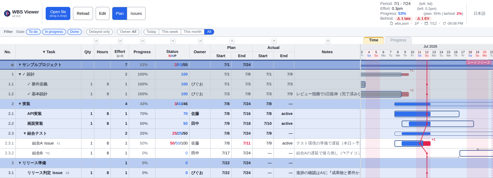
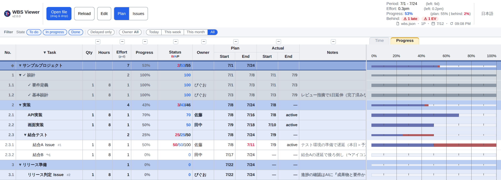
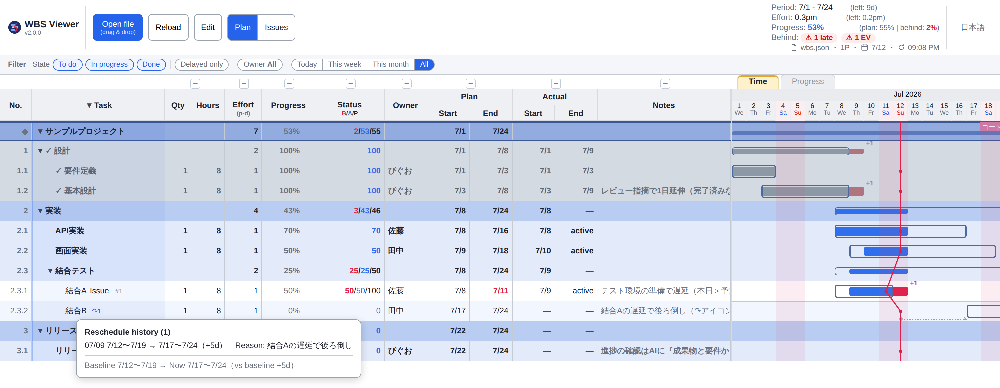
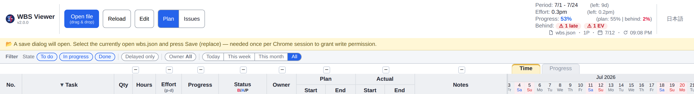
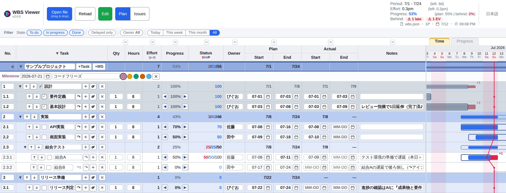

#  single-file-wbs

> A dependency-free, single-file WBS / Gantt viewer: a time-axis Gantt plus an EVM-style progress-axis view and a Japanese *inazuma* (slip / progress) line. Just open the HTML in Chrome — no server, no libraries, no build step.
> The on-screen application name is **WBS Viewer** (`single-file-wbs` is the distribution name — this repository).

**[日本語版 README はこちら / Japanese README](README.md)**



Switch with the **Time / Progress tabs** (top right). Progress view (EVM-style completion — actual, planned, behind):



## Concept

**A local WBS for the AI-era manager (PL / tech lead) leading a small, elite team that includes AI.**
Humans edit via the GUI; AI edits via raw JSON and [`CLAUDE.md`](CLAUDE.md) — the same plan.

- **Target**: not the enterprise PM of huge projects, but a **manager leading a small elite team that includes AI** (the author is this persona — dogfooding)
- **Core differentiator — two first-class interfaces**: most PM tools assume a human at a GUI. Here, **AI is also a first-class user**, maintaining the plan via raw JSON plus the AI-readable `CLAUDE.md`
- Architecture and decisions → [`docs/`](docs/index.md) ([overview](docs/design/system-overview.md), [ADRs](docs/adr/))
- Background essay (Japanese) → [WBSという至高ツールで、このAI時代をサバイブする](https://zenn.dev/piguolabo/articles/99b5b30a028f80)

## Start in 30 seconds

1. Download `wbs_viewer.html` from [Releases](https://github.com/piguo45/single-file-wbs/releases/latest)
2. Open it in Chrome (plain `file://` is fine)
3. Load a bundled data file via **Open file** (or drag & drop onto that same button)
   - **`wbs_sample.json`** — fictional sample, a format reference
   - **`wbs_roadmap.json`** — this tool's own development plan (real data, linked to GitHub issues and maintained by Claude Code)

For your own WBS, copy `wbs_sample.json` as a template (name the file anything you like). Edit and save, then press **Reload**.
Updating the tool means overwriting `wbs_viewer.html`; your `wbs.json` data is never touched.

## What it does

The latest version's main additions are the **filter bar** (narrow by state, delay, owner, and period) and **reschedule history** (record why a plan changed). See [Releases](https://github.com/piguo45/single-file-wbs/releases) for the full changelog.

### See

- **Inazuma line (progress line)** — it bulges **left of the today line when a task is behind**, making start delays and deadline overruns visible at a glance
- **Plan-vs-actual Gantt overlay** — the actual bar sits inside a plan outline. **Overrun = finish delay (red + N days); an empty gap on the left = a late start.** Done tasks are gray, and parent (aggregate) rows are thin summary bars, so state reads at a glance. Colors follow **color-universal design (CVD-aware)**
- **Progress-axis view (EVM-style)** — besides the time-axis Gantt, a **progress view whose axis is completion (0–100%)**, reachable via a tab. It shows **actual (EV), planned (PV), and how far behind** as horizontal bars (the two views are never mixed)
- **Header summary** — period, effort (person-months), and progress (EVM) stay on screen at all times. Even when ahead-work offsets the overall figure to 0%, a **badge counts the tasks that are individually behind**, so none slip through
- **Holidays and weekends at a glance** — a top-level `holidays` list renders **holidays in red** in the date header and shades **weekend and holiday columns faint pink, full height**. Remaining-business-days excludes both (2026 Japanese holidays ship with the sample data)

### Narrow down

- **Filter bar** — above the left table, four axes sit side by side: **state (to do / in progress / done), delayed-only, owner (multi-select), and period (today / this week / all)**. Values inside one axis combine with OR; axes combine with AND, so you can stack them freely — e.g. "in progress AND delayed AND assigned to me." It is **display-only**: neither `wbs.json` nor the time axis changes. Hiding a row is a blindfold, not a delete
- **Column collapse** — **+/−** above the headers fold or unfold column groups (qty+hours, progress, status, owner, plan, actual, notes), freeing up room for the Gantt
- **Column resize** — drag a column header boundary to change its width; double-click resets it to the default (widths are remembered in the browser; the data is untouched)

### Edit

- **Three ways to edit** — in-browser editing (autosave), any text editor, or **AI chat** (`CLAUDE.md` ships with the tool, so Claude Code already understands the data format)
- **Reschedule history** — confirming a reschedule via the **↷ button** in edit mode updates the plan and **records the reason** in the same action (`_planLog`). The Gantt shows only the latest change, as a dotted **trail**; clicking a task's **↷N** opens a balloon with the full history and how far it has drifted from the original plan. A plain date-cell edit — a "correction" — is treated separately and leaves no history

### Foundation

- **A single HTML file** — just open it in Chrome. No server, CDN, build step, or dependencies
- **Data is one JSON file of facts** — it holds nothing but plan and actual dates. Effort (qty × hours ÷ 8, person-days), progress, and the inazuma line are all **computed automatically**, so there are no numbers to maintain by hand
- Also: multiple projects, a collapsible tree, milestone lines, completed-task graying, auto-linked URLs in notes, a Japanese/English UI toggle

## Working the screen

- **Switch views**: the **Time / Progress tabs** (top right) toggle between the Gantt (time axis) and the progress view (completion)
- **Narrow down**: the **filter bar** above the left table narrows by state, delay, owner, and period. Only the display changes — the data never moves
- **Collapse rows**: click a project or phase name, or `▼/▶`. The **`▼/▶` in the Task column header** expands or collapses everything (**Ctrl+Z** restores the previous view after a slip)
- **Collapse columns**: the **+/−** above the headers fold or unfold column groups (qty+hours, progress, status, owner, plan, actual, notes)
- **Resize columns**: drag a column header boundary; double-click resets it to the default width
- **Gantt**: the day column under your mouse is **highlighted**, with its date emphasized in the header. **Hover a bar** to see the exact plan and actual dates

## In-browser editing (optional)

Turn the **Edit** button ON to edit directly on screen. Changes are **autosaved to `wbs.json` about 0.4 s later** (save status is always visible at the top right).

- Available: in-place editing of each field — No., name, qty, hours, owner, dates, notes (**effort is auto-computed**, so it isn't editable). Dates accept shorthand like `611` or `6/11`, full `YYYY-MM-DD`, or the 📅 picker (shows `MM-DD` for the current year). You can add a row `＋`, delete one `✕` (with confirmation), reorder `⬆⬇`, **add a nested child task** (a leaf is promoted to a summary node and the child hangs under it, with effort preserved), **edit a milestone** (`＋MS` on a project row — date, name, one of 5 color presets), and **reschedule** (the **↷ button** — enter a new plan and a reason, and confirming updates the plan while recording the change)
- Not supported (edit the JSON or ask the AI instead): drag-and-drop reordering, moving a task to a different parent, automatic renumbering

### Recording why a plan changed

"Why did this slip?" is the first thing everyone forgets once a project drags on. Confirming a reschedule via the **↷ button** updates the plan and **records the reason** at the same time. The Gantt shows only the latest change as a subtle dotted trail — it never adds rows or extra ink. The full history is always one click away via **↷N**.



<details>
<summary>⚠ Enabling edit mode requires re-selecting the file (click for steps)</summary>

When you press **Edit**, a **file save dialog opens immediately**. This is not a bug: for security, Chrome only grants a page write access to a file when **the user picks that file in a save dialog** — an unavoidable constraint of `file://`-based tools.

1. Press the **Edit** button — a save dialog opens
2. Select **the same `wbs.json` you currently have open** and press Save
3. "Replace existing file?" → **Yes**
4. When the Edit button turns **green**, you're ready

What the page looks like right after pressing Edit (a yellow guidance bar appears; the save dialog opens on top of this):



You only do this **once per Chrome session** — not every time (required again after restarting Chrome).

</details>



## Maintaining via AI chat

The number-one reason WBS charts die is **the cost of updating them**. This tool freezes the view logic (HTML) and treats the data (`wbs.json`) as the only thing that changes, so you can **delegate updates to Claude Code via chat**. The data is one plain JSON file, so no plugins or integrations are needed — bulk edits, workload aggregation, and cross-file analysis are each one sentence away.

- "Mark the design review as completed today" → sets `actual.end` to today
- "Push every June task back a week" → a bulk change
- "Total workload by owner" → an analysis the viewer itself doesn't offer
- "Archive everything completed before May" → backup plus cleanup

The bundled [`CLAUDE.md`](CLAUDE.md) ([English: `CLAUDE.en.md`](CLAUDE.en.md)) teaches the AI the data format, editing rules, and conventions.

## Data format (wbs.json)

```json
{
  "holidays": [ "2026-07-20", { "date": "2026-08-11", "name": "Mountain Day" } ],
  "projects": [
    {
      "name": "Project name",
      "milestones": [ { "date": "2026-09-30", "label": "Release", "color": "#ef4444" } ],
      "tasks": [
        { "id": "1", "name": "Phase 1", "children": [
          { "id": "1.1", "name": "Task", "qty": 1, "hours": 16, "assignee": "Owner",
            "plan":   { "start": "2026-07-01", "end": "2026-07-05" },
            "actual": { "start": null, "end": null }, "note": "",
            "_ai":    { "tokens": 70000, "minutes": 25, "model": "fable-5" },
            "_money": { "outsource": 50000, "currency": "JPY" },
            "_links": ["https://example.com/spec.md"] }
        ] }
      ]
    }
  ]
}
```

- Tasks nest up to 3 levels. A node with `children` is a summary node; without one, it's a leaf that carries effort
- `holidays` (optional, top-level) is shared across all projects. A plain string means no name; `{ date, name }` shows the name as a tooltip. **Holidays render red in the date header and shade columns pink alongside weekends**, and are excluded from the remaining-business-days count
- **Keys starting with `_` are custom keys** you can add freely (`_ai` = AI effort above, `_money` = outsourcing cost, `_links` = reference links — any structure works). The viewer ignores them, and in-browser editing preserves them. A URL you want to click belongs in `note` (auto-linked)
- The legacy single-project format `{ "project", "milestones", "tasks" }` still reads fine (backward compatible)
- For exact formulas, operations, and edge-case handling, see [`CLAUDE.en.md`](CLAUDE.en.md) — the single source of truth for the spec

## Requirements

**Google Chrome (latest) recommended.** It uses the File System Access API, so a **Chromium-based browser is required**; opening directly via `file://` works fine.

- **Microsoft Edge** and other Chromium-based browsers work too (same engine; development testing is done on Chrome)
- On corporate-managed browsers, the File System Access API may be disabled by policy — viewing still works, but **editing won't** (check `edge://policy`)
- Firefox and Safari are **not supported** (no File System Access API)

## Tests and known limitations

`tests/` bundles normal-case and broken-input sample JSONs plus e2e tests (see [`tests/INDEX.md`](tests/INDEX.md)). Design policy: graceful degradation — broken input must never crash the viewer.

Known limitations: initial rendering slows down with thousands of rows (mitigate by collapsing). Projects with identical names share collapse state. There's no keyboard navigation or screen-reader support (a mouse-first personal tool).

## License

[MIT](LICENSE)
