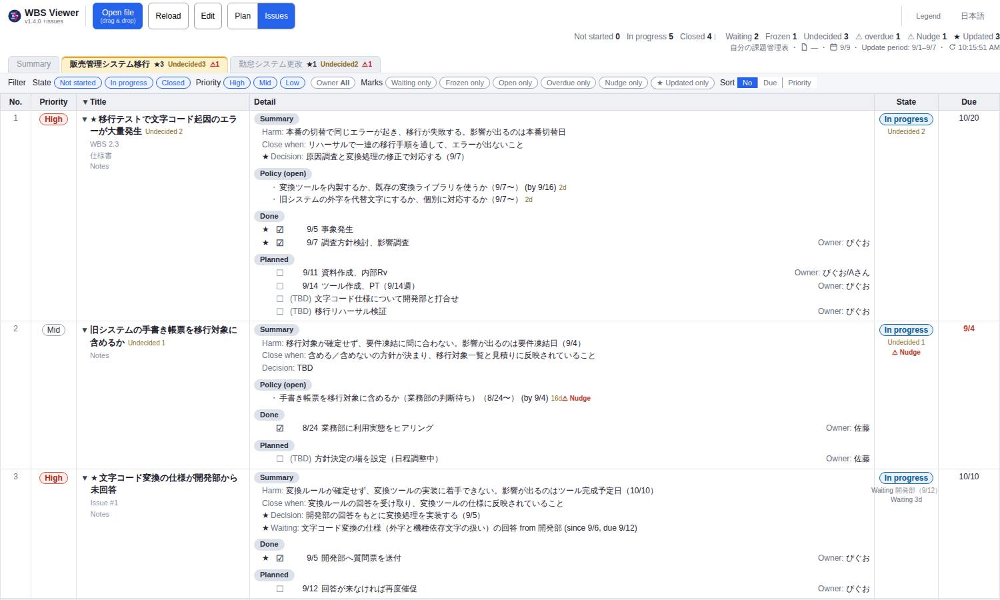

#  single-file-wbs

> A single-file viewer that runs **the plan (WBS) and the issues in one page**.
> No server, no libraries, no build step. Open it in Chrome straight from `file://`.

The on-screen application name is **WBS Viewer** (`single-file-wbs` is the distribution name — this repository).

**[日本語版 README / Japanese README](README.md)**

Plan: a Gantt that overlays actuals on the planned frame, with the *inazuma* (slip) line breaking left of today.

Issues: flip **Plan｜Issues** in the toolbar and the same file's issue table appears.

## Concept

- **One HTML file and one JSON file**
  Open via `file://`; saving writes back to that same file (File System Access API).
- **Humans edit via the screen, AI edits via raw JSON — the same table**
  The bundled [`CLAUDE.en.md`](CLAUDE.en.md) is not a read-me; it is the spec written for AI.
- **The plan holds "when, who, how much"; the issues hold "what, why, and what makes it done"**
  Only the issue side carries links, and the screen jumps both ways (nothing is written on the plan side).

## Start in 30 seconds

1. Download `wbs_viewer.html` from [Releases](https://github.com/piguo45/single-file-wbs/releases/latest)
2. Open it in Chrome (plain `file://` is fine)
3. Load `wbs_sample_issues.json` via **Open file** (or drag & drop onto that same button)

Copy a sample as the template for your own data. Edit, save, then press **Reload**.
Edit mode (editing on the screen) asks you to re-pick the same file once per Chrome session — that selection is how the browser grants write permission (steps are in [`CLAUDE.en.md`](CLAUDE.en.md)).

## What it does

Plan (WBS)

- **Planned-vs-actual Gantt overlay** — actual bars sit on the planned frame; finish slip (red, +N days) and late starts read at a glance
- **Progress-axis view (EVM-style)** — a tab whose x-axis is completion; actual (EV), planned (PV) and behind are shown as bars
- **Inazuma (slip) line** — rows breaking left of the today line are behind
- **Reschedule history** — `↷` records a plan change with its reason. You type only actual dates; effort, progress and the lines are derived

Issues

- **Two questions and a close condition** — what breaks if ignored / what you gain if done, and what state proves it is finished
- **Undecided, waiting and frozen marks** — the state is only Not started / In progress / Closed; the reason for a stall stacks on top as a mark
- **★ Updated and ⚠ Nudge** — rows that moved during the reporting window get ★; an overdue wait or open question gets ⚠ Nudge
- **Moving between plan and issues** — `WBS 2.3` on an issue and the `Issue #3` tag on a task move you within the same page

## Asking an AI

The data is one plain JSON file, so you can hand updates to a chat.

- "2.3 started" → today goes into `actual.start`
- "Put #3 on waiting — the dev team's answer, by 9/12" → `pending` gets who / what / by when, and past 9/12 an `⚠ Nudge` appears
- "Report this round's ★" → the issues that moved during the reporting window, as a list (the JSON is not changed)

The conventions live in [`CLAUDE.en.md`](CLAUDE.en.md). An AI reads that before touching the data.

## More

- Spec and AI conventions → [`CLAUDE.en.md`](CLAUDE.en.md) (Japanese original: [`CLAUDE.md`](CLAUDE.md))
- Design documents and ADRs → [`docs/`](docs/index.md) ([overview](docs/design/system-overview.md), [ADRs](docs/adr/))
- Running the regression suites → [`tests/e2e/README.md`](tests/e2e/README.md) (plan), [`tests/e2e_issue/README.md`](tests/e2e_issue/README.md) (issues)
- Requirements → Google Chrome (latest) recommended; Edge and other Chromium browsers work. Firefox and Safari are not supported (no File System Access API)
- Samples → [`wbs_sample.json`](wbs_sample.json) (plan only), [`wbs_sample_issues.json`](wbs_sample_issues.json) (plan + issues)
- Legend of states and marks → the `?` on the issue toolbar
- Changelog → [Releases](https://github.com/piguo45/single-file-wbs/releases)

## License

[MIT](LICENSE)
