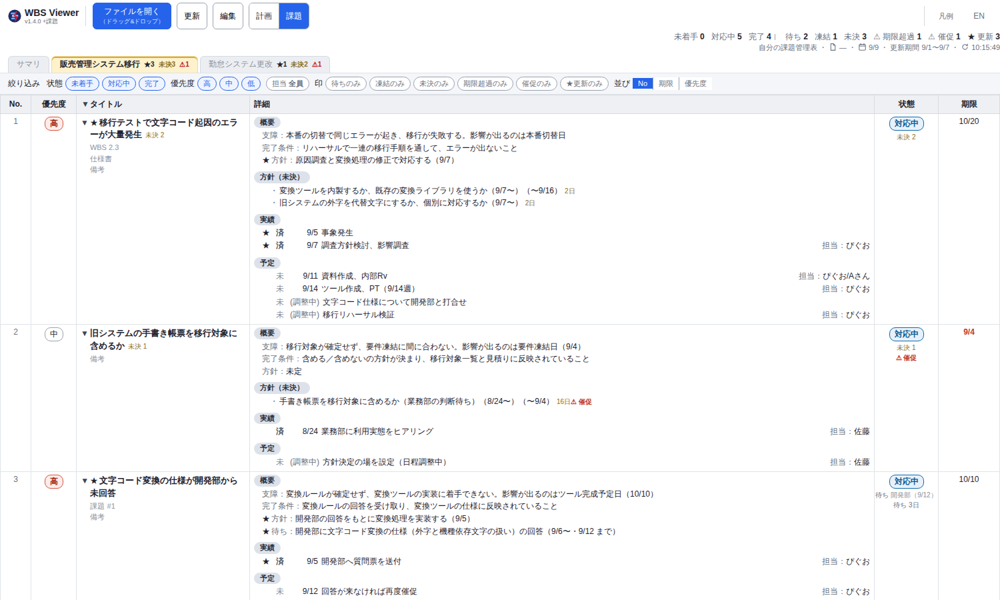

#  WBS Viewer

> 単一HTMLで動く、**計画（WBS）と課題を1枚で回す**ビューア。
> サーバーも依存ライブラリもビルドも要らない。Chrome で `file://` のまま開く。

画面上のアプリ名は **WBS Viewer**（`single-file-wbs` は配布名で、このリポジトリの名前）。

**[English README](README.en.md)**

計画：予定の枠に実績を重ねたガント。本日線から左へ突出した折れ線がイナズマ線。

課題：操作バーの **「計画｜課題」** を課題側にすると、同じファイルの課題管理表が出る。

## コンセプト

- **1枚のHTMLと1つのJSON**
  `file://` で開き、保存も同じファイルへ書き戻す（File System Access API）。
- **人は画面で、AIは素のJSONで、同じ表を編集する**
  同梱の [`CLAUDE.md`](CLAUDE.md) は読み物ではなく、AI向けの仕様書として置いてある。
- **計画は「いつ・誰が・どれだけ」、課題は「何を・なぜ・どうなったら終わりか」**
  つなぐのは課題側のリンクだけで、画面が両方向に飛ぶ（計画側のデータには何も書かない）。

## 30秒で始める

1. [Releases](https://github.com/piguo45/single-file-wbs/releases/latest) から `wbs_viewer.html` をダウンロードする
2. Chrome で開く（`file://` のままでよい）
3. **「ファイルを開く」** で `wbs_sample_issues.json` を読み込む（同じボタンへのドラッグ&ドロップでも可）

自分のデータはサンプルをコピーして作る。編集して保存し、**「更新」** で反映する。
画面上から直接編集する **「編集」** モードは、Chrome を起動してから最初の1回だけ同じファイルを選び直す（書き込み許可のため。手順は [`CLAUDE.md`](CLAUDE.md)）。

## できること

計画（WBS）

- **予実オーバーレイのガント**：予定の枠に実績のバーを重ね、終了遅延（赤＋N日）と着手遅れが一目で分かる
- **進捗軸ビュー（EVMに倣う）**：横軸を完了率にしたタブ。実績（EV）、予定（PV）、遅れを横バーで示す
- **イナズマ線**：本日線から左へ突出した行が遅れている
- **リスケ履歴**：`↷` で予定変更を理由つきで残す。手で書くのは実績の日付だけで、工数・進捗・線は自動計算

課題

- **二つの問いと完了条件**：放置すると何が起きるか（支障）／やると何が得られるか（価値）と、どうなったら閉じられるか
- **未決・待ち・凍結の印**：状態は 未着手／対応中／完了 の3つだけ。止まっている理由は印として重ねて付く
- **★更新と⚠催促**：更新期間に動いた行に ★。待ちや未決の期限切れには ⚠ 催促
- **計画との行き来**：課題の `WBS 2.3` と計画の `課題 #3` の札で、同じページの中を行き来する

## AIに頼む

データが素のJSON1枚なので、更新をチャットで任せられる。

- 「2.3 着手した」→ `actual.start` に本日が入る
- 「#3 を待ちにして、開発部の回答、9/12 まで」→ `pending` に誰を・何を・いつまでが入り、9/12 を過ぎると `⚠ 催促` が出る
- 「今回の★を報告して」→ 更新期間に動いた課題が箇条書きで出る（JSONは変えない）

作法は [`CLAUDE.md`](CLAUDE.md) に書いてある。AIはこれを読んでからデータを触る。

## もっと詳しく

- 仕様とAIの作法 → [`CLAUDE.md`](CLAUDE.md)（英語版は [`CLAUDE.en.md`](CLAUDE.en.md)）
- 設計文書とADR → [`docs/`](docs/index.md)（[全体概要](docs/design/system-overview.md)、[ADR](docs/adr/)）
- 回帰網の回し方 → [`tests/e2e/README.md`](tests/e2e/README.md)（計画）、[`tests/e2e_issue/README.md`](tests/e2e_issue/README.md)（課題）
- 動作環境 → Google Chrome（最新版）推奨。Edge などのChromium系でも動く。Firefox/SafariはFile System Access API未対応のため不可
- サンプル → [`wbs_sample.json`](wbs_sample.json)（計画だけ）、[`wbs_sample_issues.json`](wbs_sample_issues.json)（計画＋課題）
- 状態と印の凡例 → 課題側の操作バーの **「凡例」ボタン**
- 更新履歴 → [Releases](https://github.com/piguo45/single-file-wbs/releases)

## ライセンス

[MIT](LICENSE)
