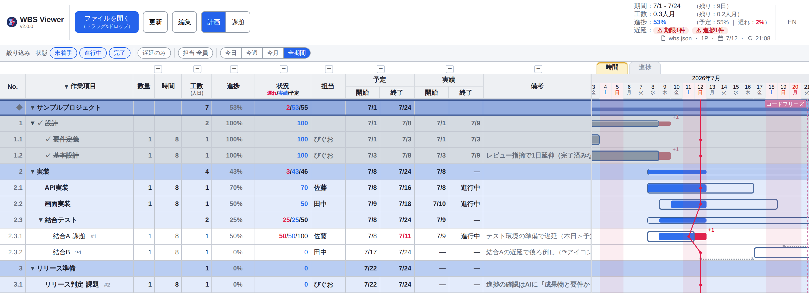
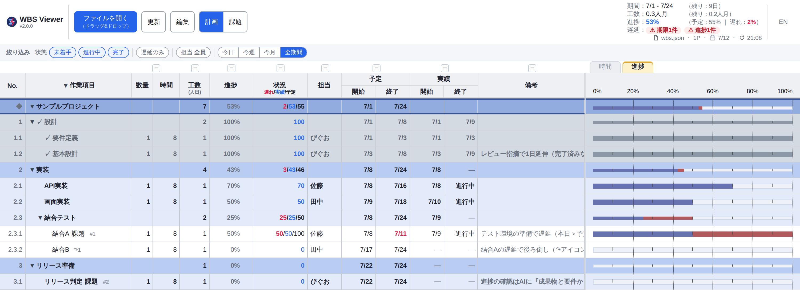
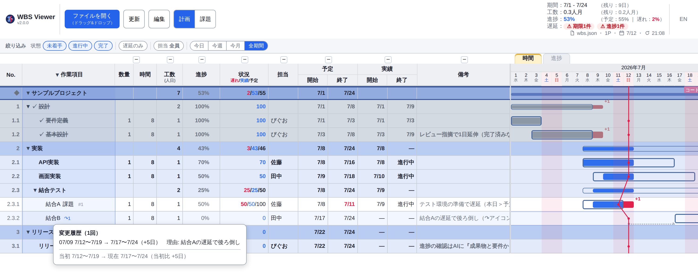
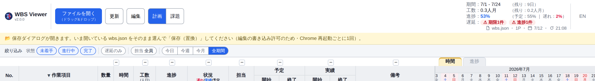
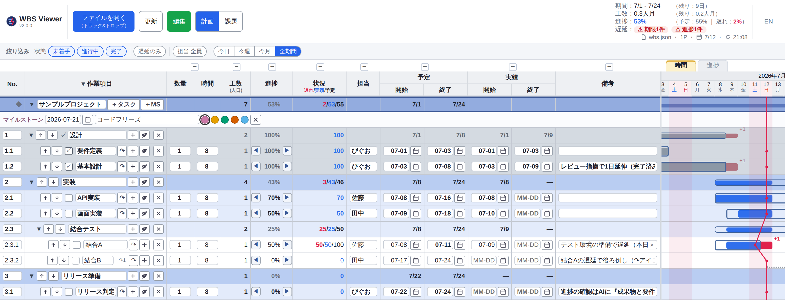

#  WBS Viewer

> 単一HTMLで動く、ガントチャート（時間軸）とEVMに倣った進捗軸ビュー、イナズマ線（進捗線）を持つWBSビューア。サーバーも依存ライブラリもビルドも要らない。
> 画面上のアプリ名は **WBS Viewer**（`single-file-wbs` は配布名で、このリポジトリの名前）。

**[English README](README.en.md)**



右上の**「時間／進捗」タブ**で切り替える。進捗ビュー（EVMに倣った完了率表示。実績、予定、遅れ）：



## コンセプト

**AI時代の管理者（PL／テックリード）が、AIを含む少数精鋭チームを率いるためのローカルWBS。**
人間はGUIで、AIは素のJSONと[`CLAUDE.md`](CLAUDE.md)で、**同じ計画を編集する**。

- **対象**：巨大プロジェクトのエンタープライズPMではなく、**AIを含む少数精鋭を率いる管理者**（作者自身がこのペルソナ。ドッグフーディングしている）
- **核の差別化＝2つの第一級インターフェース**：大半のPMツールは人間（GUI）前提。本ツールは**AIも第一級ユーザー**として、素のJSONとAI可読な `CLAUDE.md` で計画を保守できる
- 設計の全体像と判断の経緯 → [`docs/`](docs/index.md)（[全体概要](docs/design/system-overview.md)、[ADR](docs/adr/)）
- 背景の論考 → [WBSという至高ツールで、このAI時代をサバイブする](https://zenn.dev/piguolabo/articles/99b5b30a028f80)

## 30秒で始める

1. [Releases](https://github.com/piguo45/single-file-wbs/releases/latest) から `wbs_viewer.html` をダウンロード
2. Chrome で開く（`file://` のままでよい）
3. **「ファイルを開く」**（同じボタンへのドラッグ&ドロップでも可）で同梱データを読み込む
   - **`wbs_sample.json`** — 架空のサンプル。フォーマットのお手本
   - **`wbs_roadmap.json`** — 本ツール自身の開発計画（実データ。Issue と連動し Claude Code が保守）

自分のWBSは `wbs_sample.json` を雛形にコピーして作る（ファイル名は自由）。編集して保存し、**「更新」**で反映する。
アップデートは新しい `wbs_viewer.html` を上書きするだけで、`wbs.json` のデータには触れない。

## できること

最新版の主な追加は**フィルタバー**（状態、遅延、担当、期間で絞り込む）と**リスケ履歴**（予定変更の経緯を記録する）。更新履歴の全体は [Releases](https://github.com/piguo45/single-file-wbs/releases) を参照。

### 見る

- **イナズマ線（進捗線）** — 本日線から**左へ突出すると遅延**。着手遅れや期限超過が折れ線で一目でわかる
- **予実オーバーレイのガント** — 予定（枠）に実績（塗りバー）を重ねる。**枠からのはみ出しは終了遅延（赤＋N日）、枠の左の空きは着手遅れ**。完了はグレー、親（集約）は細いサマリーバーで状態が一目。配色は**色覚多様性（CUD）に配慮**
- **進捗軸ビュー（EVMに倣う）** — 時間軸のガントに加え、**横軸を完了率（0〜100%）にした進捗ビュー**をタブで切り替える。**実績（EV）、予定（PV）、遅れ**を横バーで示す（2つの表示は混ぜない）
- **ヘッダの全体サマリ** — 期間、工数（人月）、進捗（EVM）を常時表示。前倒し分が相殺して全体が0%でも、**遅れているタスクの件数をバッジ**で見落とさない
- **祝日と土日が一目** — トップレベルの `holidays` で**祝日を日付ヘッダに赤字**、ガントの**土日と祝日の列を全高で薄ピンク**にする。残り営業日の計算も土日と祝日を除外する（同梱データに2026年の日本の祝日入り）

### 絞り込む

- **フィルタバー** — 左表の真上に**状態（未着手／進行中／完了）、遅延のみ、担当（複数選択）、期間（今日／今週／全期間）**の4つの軸を並べる。軸の中はOR、軸をまたぐとANDで自由に重ねられる（例：進行中かつ遅延かつ自分の担当）。**表示専用**で `wbs.json` も横軸（時間範囲）も変えない。隠すのは目隠しであって削除ではない
- **列の折りたたみ** — 列ヘッダ上の **+/−** で列グループ（数量+時間、進捗、状況、担当、予定、実績、備考）を畳んだり広げたりできる。ガント領域を広く使える

### 編集する

- **3とおりの編集経路** — ブラウザ内編集（自動保存）、テキストエディタ、**AIチャット**（`CLAUDE.md` が同梱されており Claude Code はデータ形式を理解済み）
- **リスケ履歴** — 編集モードの**↷ボタン**でリスケを確定すると、予定が自動更新されると同時に**理由つきで履歴に記録**される（`_planLog`）。ガントには直近の変更だけ**トレイル（点線）**で示され、タスク名の**↷N**をクリックすると**全履歴と当初比**が吹き出しで見える。日付セルを直接編集する「訂正」とは区別され、訂正は履歴に残らない

### 土台

- **単一HTMLファイル** — Chrome で開くだけ。サーバーもCDNもビルドも依存も要らない
- **データは事実だけのJSON1枚** — 持つのは予定と実績の日付だけ。工数（数量×時間÷8、人日）や進捗、イナズマ線は**すべて自動計算**され、手でメンテする数字がない
- ほか：複数プロジェクト、折りたたみ、マイルストーン線、完了タスクのグレー表示、備考URLの自動リンク、日本語/英語UIの切り替え

## 画面の操作

- **表示の切り替え**：右上の**「時間／進捗」タブ**で、ガント（時間軸）と進捗ビュー（完了率）を切り替える
- **絞り込み**：左表の上の**フィルタバー**で状態、遅延、担当、期間を絞る。表示だけが変わり、データは動かない
- **行の折りたたみ**：プロジェクトや工程名、`▼/▶` をクリックする。**作業項目ヘッダの `▼/▶`** で全展開、全たたみ（誤操作は **Ctrl+Z** で直前の表示に戻せる）
- **列の折りたたみ**：列ヘッダ上の **+/−** で列グループ（数量+時間、進捗、状況、担当、予定、実績、備考）を畳んだり広げたりする
- **ガント**：マウスのある**日の列がハイライト**され日付ヘッダが強調される。**バーにカーソルを当てる**と予定と実績の正確な日付が出る

## ブラウザ上で編集（任意）

**「編集」ボタン**をONにすると画面上から直接編集できる。変更は**約0.4秒後に `wbs.json` へ自動保存**される（保存状態は右上に常時表示）。

- できること：各フィールドのその場編集（No.、名前、数量、時間、担当、日付、備考。**工数は自動計算**なので編集対象外）。日付は `611` や `6/11` のような短縮入力、`YYYY-MM-DD`、📅カレンダー（今年は `MM-DD` 表示）を受け付ける。行の追加 `＋`、削除 `✕`（確認あり）、上下移動 `⬆⬇`、**入れ子（子タスク）の追加**（リーフを集計ノードに昇格して子をぶら下げる。工数は保存される）、**マイルストーン編集**（プロジェクト行の `＋MS`。日付、名前、5色プリセット）、**リスケ**（↷ボタン。新しい予定と理由を入力して確定すると、予定の更新と履歴記録が同時に行われる）
- できないこと（JSON直編集かAIに依頼する）：ドラッグ&ドロップでの並び替え、別の親への移動、No.の自動振り直し

### 予定変更の経緯を残す

「なぜ後ろ倒しになったのか」は、プロジェクトが長引くほど記憶から消える。**↷ボタン**でリスケを確定すると、予定の更新と同時に**理由つきで履歴が残る**。ガントには直近の変更だけが控えめなトレイル（点線）で表示され、行やインクを増やさない。過去の全履歴は**↷Nをクリック**すればいつでも読み返せる。



<details>
<summary>⚠ 編集ONには「ファイルの選び直し」が必要（クリックで手順を表示）</summary>

「編集」ボタンを押すと、いきなり**ファイルの保存ダイアログが開く**。これは故障ではない。Chromeのセキュリティ上、**ブラウザがファイルに書き込む許可を得るには、保存ダイアログでユーザー自身がファイルを選ぶ必要がある**ためだ（`file://` で開くツールの宿命）。

1. **「編集」ボタン**を押す。保存ダイアログが開く
2. **いま開いている `wbs.json` と同じファイル**をそのまま選んで「保存」する
3. 「既存のファイルを置き換えますか？」には**はい**
4. 編集ボタンが**緑**になれば準備完了

「編集」を押した直後の画面（黄色い案内バーが出る。この後ろに保存ダイアログが開いている）：



この選び直しは**毎回ではなく、Chrome を起動してから最初の編集ONの1回だけ**でよい（Chrome を再起動すると再び必要になる）。

</details>



## AIチャットで保守する

WBSが続かない最大の理由は**「更新の手間」**にある。このツールは表示ロジック（HTML）を固定しデータ（`wbs.json`）だけを編集する設計なので、**Claude Code等のAIにチャットで更新を任せられる**。データが素のJSON1枚だからプラグインも連携設定も要らず、一括変更や負荷集計、ファイル横断の分析まで一言で頼める。

- 「設計レビューを今日完了にして」→ `actual.end` に本日が入る
- 「6月のタスクを全部1週間後ろ倒し」→ 一括変更
- 「担当別の負荷を集計して」→ ビューアにない分析もその場で
- 「5月以前の完了をアーカイブして」→ バックアップ作成と整理

同梱の [`CLAUDE.md`](CLAUDE.md) でAIはデータ形式、編集ルール、運用方針を理解済みだ。

## データ形式（wbs.json）

```json
{
  "holidays": [ "2026-07-20", { "date": "2026-08-11", "name": "山の日" } ],
  "projects": [
    {
      "name": "プロジェクト名",
      "milestones": [ { "date": "2026-09-30", "label": "リリース", "color": "#ef4444" } ],
      "tasks": [
        { "id": "1", "name": "フェーズ1", "children": [
          { "id": "1.1", "name": "作業", "qty": 1, "hours": 16, "assignee": "担当",
            "plan":   { "start": "2026-07-01", "end": "2026-07-05" },
            "actual": { "start": null, "end": null }, "note": "",
            "_ai":    { "tokens": 70000, "minutes": 25, "model": "fable-5" },
            "_money": { "outsource": 50000, "currency": "JPY" },
            "_links": ["https://example.com/spec.md"] }
        ] }
      ]
    }
  ]
}
```

- タスクは最大3階層。`children` があれば集計ノード、なければリーフ（工数を持つ）
- `holidays`（任意、トップレベル）は全プロジェクト共通。文字列形は名称なし、`{ date, name }` 形は名称をツールチップ表示する。**祝日は日付ヘッダで赤字、土日とともに列を薄ピンクに**し、残り営業日の計算からも除外する
- **`_` 始まりのキーはカスタムキー**として自由に追加できる（上例の `_ai` はAI実績、`_money` は外注費、`_links` は参考リンク。構造も自由）。ビューアは無視し、ブラウザ編集でも保持される。クリックして開きたいURLは `note` へ書く（自動リンク化される）
- 旧形式 `{ "project", "milestones", "tasks" }`（単一プロジェクト）も後方互換で読める
- 計算式や運用、異常系の扱いなど詳細仕様は [`CLAUDE.md`](CLAUDE.md)（仕様の単一ソース）

## 動作環境

**Google Chrome（最新版）推奨**。File System Access APIを使うため**Chromium系ブラウザ専用**で、`file://` 直開きで動く。

- **Microsoft Edge** などのChromium系でも動く（エンジンが同じため。検証はChromeで実施）
- 会社管理のブラウザでは、ポリシーでFile System Accessが無効だと**編集機能が使えない**ことがある（閲覧は可能。`edge://policy` で確認できる）
- Firefox/Safariは**非対応**（File System Access API未対応）

## テストと既知の制限

`tests/` に正常系と異常系のサンプルJSONとe2eテストを同梱する（一覧は [`tests/INDEX.md`](tests/INDEX.md)）。壊れた入力でもクラッシュしない方針（graceful degradation）。

既知の制限：大量行（数千〜）で初期描画が重い（折りたたみで緩和できる）。同名プロジェクトは折りたたみ状態を共有する。キーボード操作とスクリーンリーダーには非対応（マウス前提）。

## ライセンス

[MIT](LICENSE)
