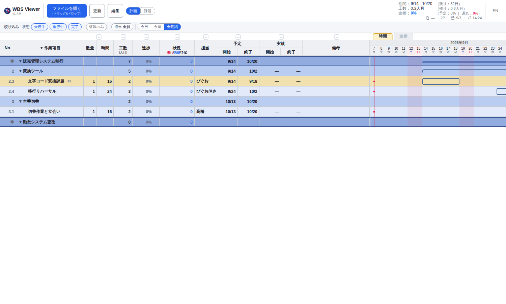

#  WBS Viewer

> 単一HTMLで動く、**計画（WBS）と課題（Issue）を1枚で回す**ビューア。サーバーも依存ライブラリもビルドも要らない。
> ガントチャート（時間軸）、EVMに倣った進捗軸ビュー、イナズマ線（進捗線）に加え、**v2.0.0 から課題管理表**が同じ画面に入った。
> 操作バーの **「計画｜課題」** で切り替え、`WBS 2.3` や `課題 #3` のリンクを押すと**同じページの中で**行き来する。
> 画面上のアプリ名は **WBS Viewer**（`single-file-wbs` は配布名で、このリポジトリの名前）。

**[English README](README.en.md)**


右上の**「時間／進捗」タブ**で切り替える。進捗ビュー（EVMに倣った完了率表示。実績、予定、遅れ）：


**「計画｜課題」** を課題側にすると、同じファイルの課題管理表が出る：


## 5分で分かる

**計画（WBS）側で手で触るのは「実績の日付」だけ。**
工数・進捗率・ガント・イナズマ線は**すべて自動計算**なので、データに書かない。
着手したら `actual.start`、終わったら `actual.end`（`✓` とグレーの行になる）。
**予定を後ろ倒しするときは日付を直接書き換えず、リーフ行の `↷`（リスケ）** を使う——変更の経緯が `_planLog` に1行残る（直接編集は「訂正」扱いで履歴に残らない）。

**課題側でやることは5つの動詞だけ。**画面のどこを触るかまで対応している。

| 動詞 | いつ | 画面 | 書かれるもの |
|---|---|---|---|
| **載せる** | 放置すると支障が出る／やると価値が出る、と言えるとき | 絞り込みバー右端の **`＋課題`** | `title`／`支障：` か `価値：`／`期限`／`完了条件` |
| **行動を済にする** | 何かやったとき | 詳細の行動行の **`済⇄未`** | `actions[].done`（**これで「対応中」になる**） |
| **決める** | 決めるべきことが出たとき／決まったとき | **「方針（未決）」の帯**の `＋方針`・各行の行頭の `確定` | `decisions[]`（`decided: null` なら未決、日付が入れば方針） |
| **待つ・凍結する** | 相手の返事待ち／意図的に止めるとき | **`待ち`**（誰を・何を・いつまで）・**`凍結`**（再開条件） | `pending`（`kind: "waiting"` か `"frozen"`） |
| **クローズする** | 完了条件を確かめたとき／やらないと決めたとき | **`クローズ`**（解決／対応しない／発生せず／重複） | `closed`（`how` と、確かめた事実） |

**課題の読み方は「状態3つ＋印6つ」だけ。**

- **状態（1行に1つ）**：**未着手**（まだ何も済んでいない）／**対応中**（済んだ行動がある）／**完了**（クローズ済み）。
- **印（重なって付く）**：`待ち`／`凍結`／`未決 N`／`⚠ 期限超過`／`⚠ 催促`／`★ 更新`。
- だから「**対応中だけど未決が2件**」「**未着手だけど相手待ち**」がそのまま1行で読める。状態を1つの箱に押し込めていたら、この2つは見えなくなる。
- **`⚠ 催促` は「追いかけ忘れ」の合図**。待ちの期限切れ・未決の期限切れ・待っていた課題が終わったのに解除していない、の3つで自動的に付く。

課題側の操作バーの **凡例（`?`）** に、状態と印の意味が一覧で出る（覚えなくてよい）。
詳しい形と式は [`CLAUDE.md`](CLAUDE.md)（**計画も課題もこの1本で完結**する）。

## コンセプト

**AI時代の管理者（PL／テックリード）が、AIを含む少数精鋭チームを率いるためのローカルな計画表＋課題表。**
人間はGUIで、AIは素のJSONと[`CLAUDE.md`](CLAUDE.md)で、**同じ1枚を編集する**。

- **対象**：巨大プロジェクトのエンタープライズPMではなく、**AIを含む少数精鋭を率いる管理者**（作者自身がこのペルソナ。ドッグフーディングしている）
- **核の差別化＝2つの第一級インターフェース**：大半のPMツールは人間（GUI）前提。本ツールは**AIも第一級ユーザー**として、素のJSONとAI可読な `CLAUDE.md` で計画と課題を保守できる
- **計画と課題を分けない**：「いつ・誰が・どれだけ」は計画（`tasks`）、「何を・なぜ・どうなったら終わりか」は課題（`issues`）。**同じ案件の中に並べる**ので、「遅れているタスクに紐づく未決の課題は？」に1ファイルで答えられる
- **状態は3つだけ、あとは印**：課題の状態は **未着手／対応中／完了**（済んだ行動があるか、閉じたか）。**待ち・凍結・未決・期限超過・催促・★更新は「印」**で、状態と重ねて付く
- **手で書く状態列を持たない**：計画の進捗も課題の状態も**すべて事実から計算**する。だから「閉じたのに対応中のまま」が起きない
- **止まっている理由が必ず添う**：**待ち**には「誰を・何を・いつまで」、**凍結**には「再開条件」が要る。**`いつまで` を過ぎた待ちには `⚠ 催促` が自動で付く**
- 設計の全体像と判断の経緯 → [`docs/`](docs/index.md)（[全体概要](docs/design/system-overview.md)、[ADR](docs/adr/)）
- 背景の論考 → [WBSという至高ツールで、このAI時代をサバイブする](https://zenn.dev/piguolabo/articles/99b5b30a028f80)／[課題管理とはなにか？](https://knowledge.piguo.org/notes/what-is-issue-management/)

## 30秒で始める

1. [Releases](https://github.com/piguo45/single-file-wbs/releases/latest) から `wbs_viewer.html` をダウンロード
2. Chrome で開く（`file://` のままでよい）
3. **「ファイルを開く」**（同じボタンへのドラッグ&ドロップでも可）で同梱データを読み込む
   - **`wbs_sample.json`** — 計画だけの架空サンプル。従来のフォーマットのお手本
   - **`wbs_sample_issues.json`** — **計画と課題**の架空サンプル（2案件・1件目は計画と課題が同居。**3状態と6つの印を網羅**）
   - **`wbs_roadmap.json`** — 本ツール自身の正本（実データ。**開発計画と課題が同居**。Claude Code が保守）
4. 操作バーの **「計画｜課題」** で切り替える（計画だけ・課題だけの JSON ではスイッチは出ない）

自分のデータは `wbs_sample.json`（計画だけ）か `wbs_sample_issues.json`（計画＋課題）を雛形にコピーして作る（ファイル名は自由。慣用名は `wbs.json`・gitignore 済み）。
編集して保存し、**「更新」**で反映する。アップデートは新しい `wbs_viewer.html` を上書きするだけで、`wbs.json` のデータには触れない。

## できること

**v2.0.0 の目玉は課題管理の同居**（「計画｜課題」スイッチ・リンク台帳・逆引き札）。更新履歴の全体は [Releases](https://github.com/piguo45/single-file-wbs/releases) を参照。

### 見る（計画）

- **イナズマ線（進捗線）** — 本日線から**左へ突出すると遅延**。着手遅れや期限超過が折れ線で一目でわかる
- **予実オーバーレイのガント** — 予定（枠）に実績（塗りバー）を重ねる。**枠からのはみ出しは終了遅延（赤＋N日）、枠の左の空きは着手遅れ**。完了はグレー、親（集約）は細いサマリーバーで状態が一目。配色は**色覚多様性（CUD）に配慮**
- **進捗軸ビュー（EVMに倣う）** — 時間軸のガントに加え、**横軸を完了率（0〜100%）にした進捗ビュー**をタブで切り替える。**実績（EV）、予定（PV）、遅れ**を横バーで示す（2つの表示は混ぜない）
- **ヘッダの全体サマリ** — 期間、工数（人月）、進捗（EVM）を常時表示。前倒し分が相殺して全体が0%でも、**遅れているタスクの件数をバッジ**で見落とさない
- **祝日と土日が一目** — トップレベルの `holidays` で**祝日を日付ヘッダに赤字**、ガントの**土日と祝日の列を全高で薄ピンク**にする。残り営業日の計算も土日と祝日を除外する（同梱データに2026年の日本の祝日入り）
- **課題からの逆引き札** — 課題がリンクしている作業項目に、小さな **`課題 #3`** の札が出る。押すと課題へ飛ぶ。**計画側のデータには何も書かない**（`links` から逆引きして描く）



### 見る（課題）

- **案件ごとのタブとサマリ** — Excel の「1ブック＝複数シート」と同じ。ファイル1枚に案件（`projects`）を並べ、**タブで切り替える**。先頭の**サマリ**タブは、案件ごとの 未着手／対応中／完了／`待ち`／`凍結`／`未決`／`★ 更新`／`⚠ 期限超過`／`⚠ 催促`／次の期限 を並べた集計表で、行をクリックするとその案件へ飛ぶ。**描くのは開いている案件だけ**なので、案件が増えても重くならない
- **リンク台帳で行き来する** — 課題のタイトルの下に、つながり先が**1行に1つずつ**小さく出る（`WBS 2.3`／`課題 #1`／`勤怠-2`／`仕様書`）。**押すと同じページの中で移動**する（`WBS 2.3` なら「計画」に切り替わってその行へ）。URL の末尾に目印（`#wbs=…`／`#issue=…`）が付くので、ブラウザの**「戻る」で戻れる**し、URL を人に渡せば同じ行が開く。リンク先が無ければ薄い取り消し線で**壊れたリンク**と分かる
- **たたむと一覧表、開くと Excel の課題管理表** — 列は **No／優先度／タイトル／詳細／状態／期限**。開くと詳細列に概要・二つの問い・完了条件・方針・実績・予定が縦に並び（区切りは `概要` `実績` `予定` の**薄い灰の帯**）、たたむと**次の一手が1行**だけ残る
- **状態は自動で決まる** — **未着手／対応中／完了**を毎回計算する。**手で状態を書き換える欄はない**。待ち・凍結・未決・期限超過・催促は**印**として横に付く
- **放置の長さが数字で出る** — 未着手の行に「載せてから何日」、待ちの行に「待ち始めてから何日」、未決の各行に「決まらないまま何日」。**古い順に手を付けられる**
- **★ 更新（今回動いたもの）** — **更新期間**（既定＝直近7日／`star` で指定）に動いた行に ★。済んだ行動だけでなく、**決めた・止めた・閉じた**にも付く。★のある課題は**タイトルに ★** が出るので、たたんだ一覧のままで「今週動いたのはこれ」が読める
- **週次定例がそのまま回る** — 右上に `★ 更新 3` と `⚠ 期限超過 1`、メタ行に `更新期間 9/1〜9/7`。定例前に★を上から読んで報告し、終わったら `star.from` を次の週に進める
- **担当は行動ごと** — 課題に担当欄も担当列も無い。担当は**行動（`actions`）ごと**に書き、`担当：ぴぐお` の形で出る。たたむと詳細列が **`未 9/11 資料作成、内部Rv 担当：ぴぐお/Aさん`** の1行になる。「課題の担当は田中だが、次に動くのは佐藤」という食い違いが起きない
- **書き足りない行に警告** — 二つの問いが両方空、または完了条件が空の行には薄い警告マークが出る。**エラーにはしない**（載せる手は止めない）

### 絞り込む

- **フィルタバー（計画）** — 左表の真上に**状態（未着手／進行中／完了）、遅延のみ、担当（複数選択）、期間（今日／今週／今月／全期間）**の4つの軸を並べる。軸の中はOR、軸をまたぐとANDで自由に重ねられる。**表示専用**で `wbs.json` も横軸（時間範囲）も変えない
- **フィルタバー（課題）** — 状態／優先度／担当（複数選択）／**印**（`待ち`・`凍結`・`未決`・`期限超過`・`催促`・`★ 更新`）の4軸。担当は**行動に出てくる全員**から集まる。並び順は No（データ順）／期限／優先度
- **列の折りたたみ** — 列ヘッダ上の **+/−** で列グループ（数量+時間、進捗、状況、担当、予定、実績、備考）を畳んだり広げたりできる。ガント領域を広く使える
- **列幅の変更** — 列ヘッダの境界をドラッグして幅を変えられる。ダブルクリックで既定幅に戻る（幅はブラウザに記憶。データは変わらない）

### 編集する

- **3とおりの編集経路** — ブラウザ内編集（自動保存）、テキストエディタ、**AIチャット**（`CLAUDE.md` が同梱されており Claude Code はデータ形式を理解済み）
- **リスケ履歴** — 編集モードの**↷ボタン**でリスケを確定すると、予定が自動更新されると同時に**理由つきで履歴に記録**される（`_planLog`）。ガントには直近の変更だけ**トレイル（点線）**で示され、タスク名の**↷N**をクリックすると**全履歴と当初比**が吹き出しで見える。日付セルを直接編集する「訂正」とは区別され、訂正は履歴に残らない
- **1クリックで事実を書く（課題）** — 「確定」（方針）「待ち」「凍結」「クローズ」が、必要な事実（日付・相手・期限・再開条件・確かめた事実）をまとめて書く。手で1キーだけ書いて片手落ちになるのを構造的に防ぐ

### 土台

- **単一HTMLファイル** — Chrome で開くだけ。サーバーもCDNもビルドも依存も要らない
- **データは事実だけのJSON1枚** — 持つのは予定と実績の日付、決めた・止めた・閉じたという事実だけ。工数（数量×時間÷8、人日）・進捗・イナズマ線・課題の状態・期限超過・★は**すべて自動計算**され、手でメンテする数字がない
- **静かな画面** — 「役割ごとに表現を1種類」。帯（`概要`/`実績`/`予定`）＝灰の塗り、★＝**黒の記号**、`済`／`未`＝文字の濃淡（英語UIは ☑／☐）。**枠線は優先度・状態のバッジ専用**
- ほか：複数案件（タブ）、折りたたみ、マイルストーン線、完了タスクのグレー表示、備考URLの自動リンク、`_` 始まりのカスタムキー保持、日本語/英語UIの切り替え

## 画面の操作

- **計画｜課題の切り替え**：操作バーの2択スイッチ（両方を持つファイルでだけ出る）
- **表示の切り替え（計画）**：右上の**「時間／進捗」タブ**で、ガント（時間軸）と進捗ビュー（完了率）を切り替える
- **絞り込み**：表の上の**フィルタバー**。表示だけが変わり、データは動かない
- **行の折りたたみ**：計画はプロジェクトや工程名、`▼/▶` をクリックする（**作業項目ヘッダの `▼/▶`** で全展開、全たたみ。誤操作は **Ctrl+Z** で直前の表示に戻せる）。課題は**タイトルのセルをクリック**で1行⇄全文
- **列の折りたたみ・列幅**：列ヘッダ上の **+/−**／列ヘッダの境界をドラッグ（ダブルクリックで既定幅）
- **ガント**：マウスのある**日の列がハイライト**され日付ヘッダが強調される。**バーにカーソルを当てる**と予定と実績の正確な日付が出る
- **備考**：課題の備考（`note`）は添え書きなので**普段は隠れている**。タイトル下のリンク行の末尾にある `備考` の印にマウスを置くと全文が出て、**クリックすると吹き出しが固定**され、中の URL を押せる
- **言語**：ヘッダの **EN／日本語** で切り替える（データの中身は翻訳しない）

## ブラウザ上で編集（任意）

**「編集」ボタン**をONにすると画面上から直接編集できる。変更は**約0.4秒後に `wbs.json` へ自動保存**される（保存状態は右上に常時表示）。

- **計画**：各フィールドのその場編集（No.、名前、数量、時間、担当、日付、備考。**工数は自動計算**なので編集対象外）。日付は `611` や `6/11` のような短縮入力、`YYYY-MM-DD`、📅カレンダー（今年は `MM-DD` 表示）を受け付ける。行の追加 `＋`、削除 `✕`（確認あり）、上下移動 `⬆⬇`、**入れ子（子タスク）の追加**、**マイルストーン編集**（プロジェクト行の `＋MS`）、**リスケ**（↷ボタン）
- **課題**：タイトル・優先度・期限・二つの問い・完了条件・備考のその場編集。**`待ち`／`凍結`／`クローズ`** のボタンで止まり・完了を記録する。**`＋リンク`** でリンクを足し、各リンクの `✕` で消す。**`＋課題` は絞り込みバーの右端**（追加後はその行へ自動で移動）。行動（`actions`）の追加 `＋`、担当・日付・本文の編集、済⇄未の切り替え、削除 `✕`、上下移動 `▲▼`。決めることは**「方針（未決）」の帯**で足す（`＋方針`）
- **案件**：`＋案件` で追加、タブの**ダブルクリック**で名前変更、タブの `✕` で削除（確認あり）
- できないこと（JSON直編集かAIに依頼する）：ドラッグ&ドロップでの並び替え、別の親への移動、No.の自動振り直し、複数ファイルを同時に開くこと

### 予定変更の経緯を残す

「なぜ後ろ倒しになったのか」は、プロジェクトが長引くほど記憶から消える。**↷ボタン**でリスケを確定すると、予定の更新と同時に**理由つきで履歴が残る**。ガントには直近の変更だけが控えめなトレイル（点線）で表示され、行やインクを増やさない。過去の全履歴は**↷Nをクリック**すればいつでも読み返せる。


<details>
<summary>⚠ 編集ONには「ファイルの選び直し」が必要（クリックで手順を表示）</summary>

「編集」ボタンを押すと、いきなり**ファイルの保存ダイアログが開く**。これは故障ではない。Chromeのセキュリティ上、**ブラウザがファイルに書き込む許可を得るには、保存ダイアログでユーザー自身がファイルを選ぶ必要がある**ためだ（`file://` で開くツールの宿命）。

1. **「編集」ボタン**を押す。保存ダイアログが開く
2. **いま開いている `wbs.json` と同じファイル**をそのまま選んで「保存」する
3. 「既存のファイルを置き換えますか？」には**はい**
4. 編集ボタンが**緑**になれば準備完了

「編集」を押した直後の画面（黄色い案内バーが出る。この後ろに保存ダイアログが開いている）：


この選び直しは**毎回ではなく、Chrome を起動してから最初の編集ONの1回だけ**でよい（Chrome を再起動すると再び必要になる）。

</details>


## AIチャットで保守する

WBSや課題管理表が続かない最大の理由は**「更新の手間」**にある。このツールは表示ロジック（HTML）を固定しデータ（`wbs.json`）だけを編集する設計なので、**Claude Code等のAIにチャットで更新を任せられる**。データが素のJSON1枚だからプラグインも連携設定も要らず、一括変更や負荷集計、計画と課題を横断する分析まで一言で頼める。

- 「設計レビューを今日完了にして」→ `actual.end` に本日が入る
- 「6月のタスクを全部1週間後ろ倒し」→ 一括変更
- 「移行テストのエラーを課題に載せて。放置すると本番切替で失敗する」→ 二つの問いと完了条件を埋めて1件追加
- 「#3 を待ちにして。開発部の仕様回答、9/12 まで」→ `pending` に **誰を・何を・いつまで**が入り、9/12 を過ぎると `⚠ 催促` が出る
- 「未決を洗い出して。長く止まっている順で」→ 決められる人に持ち込む一覧が、経過日数つきでその場で出る
- 「遅れているタスクに紐づく、未決の残っている課題を挙げて」→ **1ファイルなので1回の読み取りで答えられる**

同梱の [`CLAUDE.md`](CLAUDE.md) でAIはデータ形式、編集ルール、4つの動き（載せる・決める・組み込む・閉じる）、依頼の型を理解済みだ。

## データ形式（wbs.json）

```json
{
  "name": "自分の管理表",
  "holidays": [ "2026-07-20", { "date": "2026-08-11", "name": "山の日" } ],
  "star": { "from": "2026-09-01", "to": "2026-09-07" },
  "projects": [
    {
      "name": "販売管理システム移行",
      "milestones": [ { "date": "2026-10-20", "label": "本番切替", "color": "#cc79a7" } ],
      "tasks": [
        { "id": "2", "name": "変換ツール", "children": [
          { "id": "2.3", "name": "文字コード変換", "qty": 1, "hours": 16, "assignee": "ぴぐお",
            "plan":   { "start": "2026-09-14", "end": "2026-09-18" },
            "actual": { "start": null, "end": null }, "note": "",
            "_ai":    { "tokens": 70000, "minutes": 25, "model": "fable-5" } }
        ] }
      ],
      "issues": [
        {
          "id": 1,
          "title": "移行テストで文字コード起因のエラーが大量発生",
          "priority": "high",
          "opened": "2026-09-05",
          "due": "2026-10-20",
          "ifIgnored": "本番の切替で同じエラーが起き、移行が失敗する。影響が出るのは本番切替日",
          "ifDone": "",
          "closeWhen": "リハーサルで一連の移行手順を通して、エラーが出ないこと",
          "decisions": [
            { "q": "変換ツールを内製するか、既存の変換ライブラリを使うか",
              "since": "2026-09-07", "decided": null, "a": "" }
          ],
          "pending": null,
          "closed": null,
          "links": [
            { "wbs": "2.3" },
            { "issue": 3 },
            { "project": "勤怠システム更改", "issue": 2 },
            { "title": "仕様書", "url": "https://example.com/spec" }
          ],
          "actions": [
            { "date": "2026-09-05", "text": "事象発生", "assignee": "", "done": true },
            { "date": null, "text": "文字コード仕様について開発部と打合せ", "assignee": "", "done": false }
          ],
          "note": "関連リンクは links に持つ（備考は添え書き）"
        }
      ]
    }
  ]
}
```

- **`projects` は案件の配列**。1つの案件の中に**計画（`tasks`）と課題（`issues`）が並ぶ**。計画だけの案件・課題だけの案件・両方ある案件、どれも有効
- **計画（`tasks`）**：タスクは最大3階層。`children` があれば集計ノード、なければリーフ（工数を持つ）。**`qty`（数量）は繰り返し単位**（例：画面5枚 × `hours` 4h）で、単発作業なら `1` のままでよい
- `holidays`（任意、トップレベル）は全案件共通。文字列形は名称なし、`{ date, name }` 形は名称をツールチップ表示する。**祝日は日付ヘッダで赤字、土日とともに列を薄ピンクに**し、残り営業日の計算からも除外する
- **`links` はリンク台帳**。4つの形だけ ——`{ "wbs": "2.3" }`（同じ案件の計画タスク）／`{ "issue": 1 }`（同じ案件の課題）／`{ "project": "…", "issue": 2 }`（別案件）／`{ "title": "…", "url": "https://…" }`（外部URL）。**つながりは課題側にだけ書く**（計画側には書かない）
- **`decisions[]` は「決めること／決めたこと」**。`{ q, since, decided, a }` で、`decided: null` なら**未決**（画面では「方針（未決）」の帯に `14日経過（8/26〜）` の形で経過日数つきで並ぶ）、日付が入れば**方針**。1課題に**何件あってもよい**
- **`pending` は2種**。**待ち** `{ kind: "waiting", since, who, until, what }`／**凍結** `{ kind: "frozen", since, resumeWhen, detail }`。`until` を過ぎた待ちには `⚠ 催促` が付く
- **持つのは事実だけ**。工数・進捗・イナズマ線・課題の状態・印・たたんだ時の「次の一手」は書かず、日付と `decisions`／`pending`／`closed`／`actions` から自動で決まる。例外は `star`（**更新期間**＝★を付ける範囲。派生値ではなく**設定**）
- `ifIgnored`（**放置すると、いつ・何が起きるか**）と `ifDone`（**やると、いつ・何が得られるか**）は**二者択一**。どちらかに答えられるものだけ表に載せる（画面には `支障：`／`価値：` の見出しで出る）。`due`（期限）＝**支障や価値が現れる日**で、担当者がいつやるかではない
- **`_` 始まりのキーはカスタムキー**として自由に追加できる（上例の `_ai` はAI実績。`_money` や `_links` のように構造も自由）。ビューアは無視し、ブラウザ編集でも保持される
- **旧形式もそのまま読める**：計画だけの `{ "projects": [{ name, milestones, tasks }] }`、単一プロジェクトの `{ "project", "milestones", "tasks" }`。**`issues` が無いファイルは「計画」だけを描き、スイッチも出さない**
- 壊れていないかは同梱の検査スクリプトで確かめる：`uv run python scripts/check.py wbs.json`（uv が無い環境なら `python3 scripts/check.py wbs.json`。依存ゼロ。リンク先の存在・番号の重複・日付・enum を見て、`案件名 / #番号 / 項目` で指摘する）
- 計算式や運用、異常系の扱いなど詳細仕様は [`CLAUDE.md`](CLAUDE.md)（仕様の単一ソース）

## 動作環境

**Google Chrome（最新版）推奨**。File System Access APIを使うため**Chromium系ブラウザ専用**で、`file://` 直開きで動く。

- **Microsoft Edge** などのChromium系でも動く（エンジンが同じため。検証はChromeで実施）
- 会社管理のブラウザでは、ポリシーでFile System Accessが無効だと**編集機能が使えない**ことがある（閲覧は可能。`edge://policy` で確認できる）
- Firefox/Safariは**非対応**（File System Access API未対応）

## テストと既知の制限

`tests/` に正常系と異常系のサンプルJSONとe2eテストを同梱する（一覧は [`tests/INDEX.md`](tests/INDEX.md)）。壊れた入力でもクラッシュしない方針（graceful degradation）。

既知の制限：大量行（数千〜）で初期描画が重い（折りたたみで緩和できる）。同名プロジェクト・同じ `id` は折りたたみ状態を共有する。課題どうしの依存関係は持たない。案件名を変えると、その名前を指すリンクが切れる（`scripts/check.py` で確かめる）。キーボード操作とスクリーンリーダーには非対応（マウス前提）。

## ライセンス

[MIT](LICENSE)
