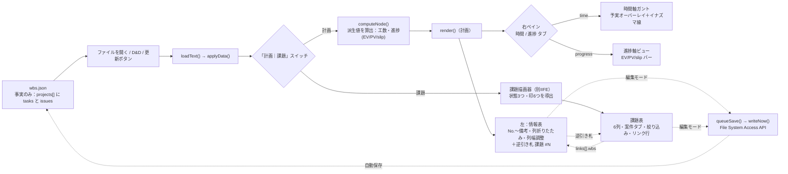
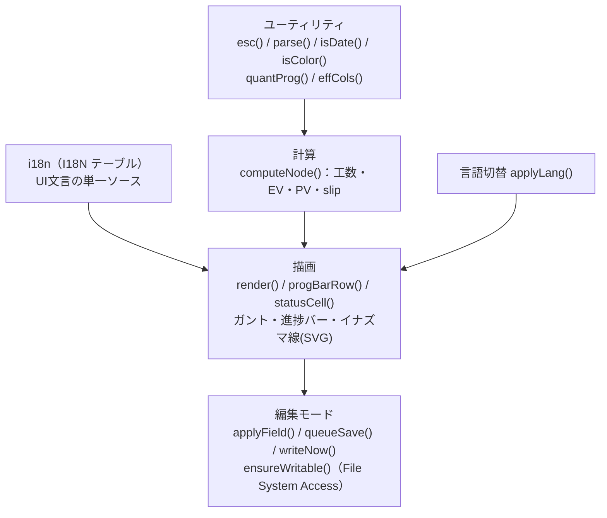

# WBS Viewer 全体概要

`wbs_viewer.html` と周辺ファイルの構成から逆生成した全体像（構成・依存・データの流れ）。

最終更新：2026-09-11（v2.0.0 ＝ 課題管理の同居を反映）

**仕様の単一ソースは [`CLAUDE.md`](../../CLAUDE.md)**（計算式・データ形式・異常系）。本書は重複させず、構成と依存の地図に絞ります。
設計判断の「なぜ」は [ADR（`docs/adr/`）](../adr/) を参照。

---

## コンセプト

> **AIを含む少数精鋭チームを率いる管理者（PL／テックリード）のためのローカルな計画表＋課題表。人間はGUIで、AIは素のJSONと `CLAUDE.md` で、同じ1枚を編集する。**

**v2.0.0 から、計画（WBS）と課題（Issue）が 1枚の HTML・1つの JSON に同居する。**
操作バーの **「計画｜課題」スイッチ**で切り替え、つながりは**課題側の `links[]` にだけ**書く（計画側のデータには何も書かない）。
移植の差し込み口と細部は [`unified-touchpoints.md`](unified-touchpoints.md)、判断は [ADR-0011](../adr/0011-plan-and-issues-in-one-json.md)。

詳細は [`CLAUDE.md` の「製品ビジョン・設計指針（#67）」](../../CLAUDE.md) と [ADR-0004（AIを第一級ユーザーにする）](../adr/0004-ai-first-json-as-api.md)。

---

## リポジトリ構成（ファイルの役割）

| パス | 役割 | 種別 |
|---|---|---|
| `wbs_viewer.html` | 製品本体。単一HTML（CSS+JS内蔵・依存ゼロ）。描画・編集・保存の全機能 | コード |
| `wbs_sample.json` | 架空データの最小サンプル（**計画だけ**・データ形式の参照用） | データ |
| `wbs_sample_issues.json` | 架空データのサンプル（**計画＋課題**・2案件。3状態と6つの印を網羅） | データ |
| `wbs_roadmap.json` | 本ツール自身の**正本**（実データ。`projects[0]` に開発計画 `tasks` と課題 `issues` が同居） | データ |
| `CLAUDE.md` / `CLAUDE.en.md` | 仕様の単一ソース（AI向けAPI仕様も兼ねる） | ドキュメント |
| `README.md` / `README.en.md` | 目的・使い方の入口 | ドキュメント |
| `docs/` | 本書・ADR・スクリーンショット | ドキュメント |
| `tests/` | 正常/異常サンプルJSON（計画＝`tests/`・課題＝`tests/issue/`）＋**2系統の e2e**（計画＝`tests/e2e/`・課題＝`tests/e2e_issue/`、いずれも headless Chromium）。[ADR-0006](../adr/0006-e2e-headless-chromium.md) | テスト |
| `scripts/check.py` | JSON の検査（番号の重複・日付・enum・`links` の指す先の存在・旧キーの残存）。依存ゼロ | ツール |
| `scripts/refresh_docs_index.py` | `docs/index.md` の自動生成 | ツール |

外部依存・DB・サーバー・定期処理・外部送信は**いずれも無い**（クライアント完結・`file://`・依存ゼロ）。
その判断は [ADR-0001](../adr/0001-dependency-free-single-file.md)。

---

## データの流れ

- **派生値はデータに持たせない**（工数 `qty×hours÷8`・進捗・座標は描画時に算出）。→ [ADR-0003](../adr/0003-no-derived-values-in-data.md)
- **入力経路は1関数に集約**（`loadText()`）。パース失敗は必ずユーザー通知。
- 右ペインは時間/進捗の**片方だけ描画**（非アクティブ側はDOM注入しない）。
- top-level の任意フィールド `holidays` ももう一つの入力。日付ヘッダの祝日着色とガントの土日／祝日列の塗り、残り営業日の算出（祝日除外・#75）に流れる。
- **課題側も派生値を持たない**：状態（未着手／対応中／完了）と6つの印（待ち・凍結・未決・期限超過・催促・★更新）は、`actions`／`decisions`／`pending`／`closed`／`due` から描画のたびに導出する。→ [ADR-0008](../adr/0008-facts-only-derived-status.md)
- **逆引き札も導出**：計画の行に出る `課題 #N` はデータに書かず、**描画のたびに課題の `links[]` から逆引き**して作る。→ [ADR-0011](../adr/0011-plan-and-issues-in-one-json.md)
- **保存パスは1本だけ**。計画側の編集も課題側の編集も同じ `queueSave() → writeNow()` を通る（キューは単一・直列化）。課題描画器は独自の保存経路を持たない。

---

## HTMLの内部構成（JSの層）

`wbs_viewer.html` の JS は **2つの IIFE** に分かれる。
**第1 IIFE ＝ 計画側**（wbs 本家の中身そのまま）、**第2 IIFE ＝ 課題描画器**。
2つをつなぐのは **`window.__PM`（橋）1つだけ**で、これが唯一の接点である。

| 橋の窓口 | 向き | 役割 |
|---|---|---|
| `PM.emit("data"\|"lang"\|"edit", …)` / `PM.on(…)` | 計画 → 課題 | 読み込み・言語切替・編集ON/OFF を課題側へ通知（購読が無ければ何もしない） |
| `PM.setBadge(fn)` / `PM.badge(key,id)` | 課題 → 計画 | 計画の作業項目セルに出す**逆引き札**のHTMLを課題側が供給（課題側が無ければ空文字） |
| `PM.gotoWbs(案件名, id)` | 課題 → 計画 | 課題の `WBS 2.3` を押したとき：表示を計画へ切替 → 祖先を展開 → スクロール → 2秒強調 |
| `PM.queueSave()` / `notice()` / `today()` / `lang()` / `isEdit()` / `data()` / `render()` | 課題 → 計画 | 保存・通知・本日・言語・編集状態・データの**共有窓口**（課題側は自前で持たない） |

**課題側が無くても計画側は素のまま動く**（橋は `emit` しても購読者ゼロ）。
逆に課題描画器は冒頭で `const PM=window.__PM; if(!PM)return;` と書き、橋が無ければ何もしない。
差し込み口の一覧と移植手順は [`unified-touchpoints.md`](unified-touchpoints.md)。

各 IIFE の中は「ユーティリティ → 計算 → 描画 → イベント」の順で並ぶ（`front-coding-style` の構成則）。

- **計算ロジック**（工数・進捗率・EVM・親の加重平均）の正は [`CLAUDE.md` 計算ロジック節](../../CLAUDE.md)。
- **編集モードは構造編集も担う**：入れ子（リーフの集計化と、最後の子削除での降格・案Y）とマイルストーンの追加／編集／削除。工数はリーフにのみ宿り、昇格／降格で総量は保存される。→ [ADR-0003](../adr/0003-no-derived-values-in-data.md)
- **左表は列折りたたみ（8グループ）と列幅調整を持つ**：列幅はヘッダー境界のドラッグで変更し、`localStorage` の `wbsColWidths` に保存する。折りたたみ状態は `wbsColCollapsed` に保存し、両者は独立に扱う。
- **保存パスは聖域**（データ消失歴あり）：書込は単一キュー直列化・mtime検知・パース成功後にハンドル差替。→ [ADR-0002](../adr/0002-file-system-access-editing.md)
- **配色はCUD配慮**（Okabe-Ito・形/位置/ラベルで冗長化）。→ [ADR-0005](../adr/0005-cud-color-design.md)
- **課題側の CSS は `#isMain` にスコープし、変数は `--is-` 接頭辞**を持つ（計画側と衝突させない＝ピクセル回帰を動かさないため）。配色監査も計画側 `tests/e2e/test_color_audit.py`／課題側 `tests/e2e_issue/test_color_audit_issue.py` の2本立て。
- **検査は `scripts/check.py`**（依存ゼロ）。番号の重複・日付・enum・`links` の指す先の存在・旧キーの残存を見る。エラーがあれば終了コード 1。

---

## 設計理由が未記録の定数（確認中）

コードに値はあるが「なぜその値か」が未記録のものは、創作せず **#76** に集約して順次確認中：

| 定数・上限 | 場所 | 追跡 |
|---|---|---|
| ネスト上限＝3階層 | `render()` の `walk()` / CSS `.lvl0-2` | #76 |
| 進捗の量子化＝10%刻み | `quantProg()` / `progStep()` | #76 |
| 工数の固定除数＝8時間/日・20日/月 | `computeNode()` / ヘッダ人月換算 | #76 |
| 自動保存デバウンス＝400ms | `SAVE_DEBOUNCE_MS` / `queueSave()` | #76 |
